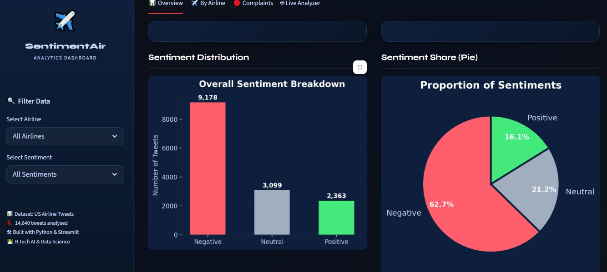
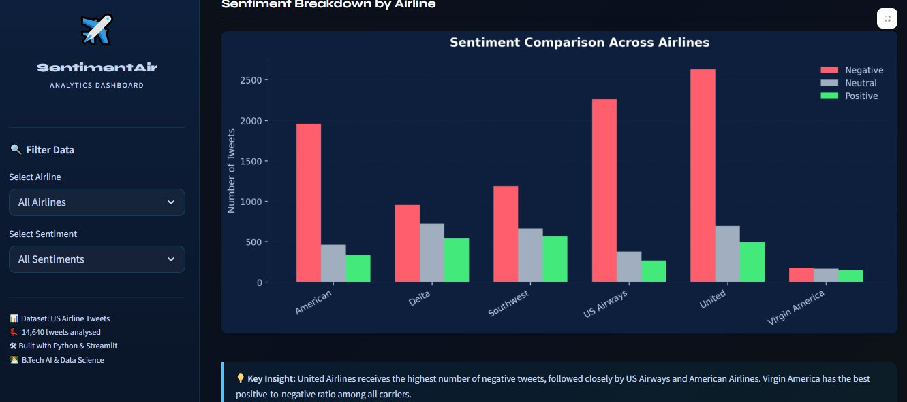
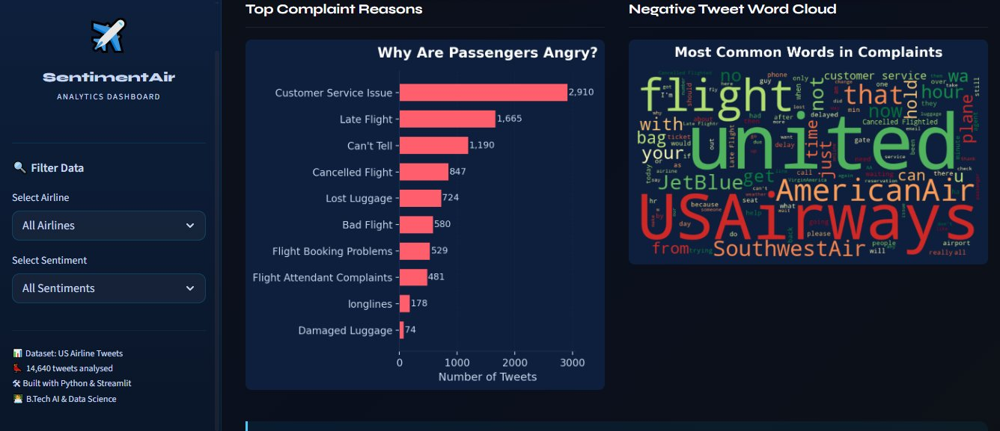
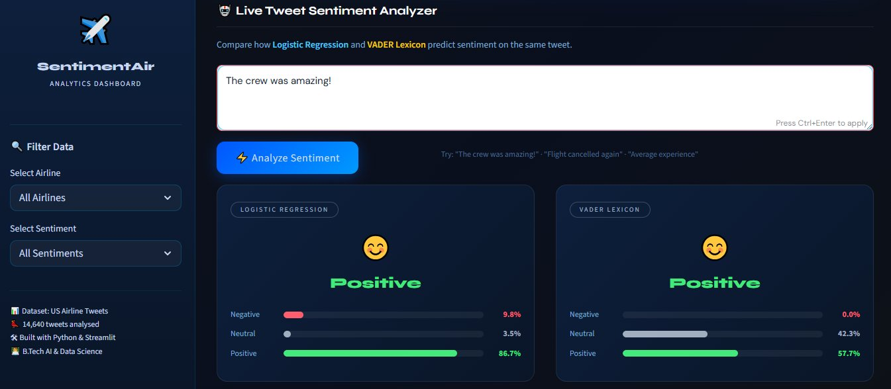

# ✈️ Airline Tweet Sentiment Analyzer

A **multi-model NLP web application** that analyzes the sentiment of airline-related tweets in real time — built with Python, Streamlit, VADER, and Logistic Regression, with a roadmap toward BERT-based transformer models.

---

## 🚀 Live Demo

> Coming soon — deploying on Render

---

## 📌 Project Overview

This project analyzes over **14,000 airline tweets** to classify sentiment as **Positive**, **Negative**, or **Neutral** using two different approaches:

| Model | Type | How it works |
|---|---|---|
| **VADER** | Lexicon-based | Reads actual sentiment words & punctuation — no training needed |
| **Logistic Regression** | Machine Learning | Trained on real tweet data using TF-IDF vectorization |

The app shows both predictions **side by side with confidence bars**, making it easy to see where the two models agree or disagree — and why.

---

## 🖼️ App Preview

### 📊 Overview — Sentiment Distribution


### ✈️ By Airline — Sentiment Comparison


### 🔴 Complaints — Top Reasons & Word Cloud


### 🤖 Live Analyzer — Logistic Regression vs VADER


---

## 🧠 What I Built

| Component | Details |
|---|---|
| **Dataset** | US Airline Tweets — 14,640 tweets |
| **Cleaning** | Lowercasing, URL/mention removal, punctuation stripping |
| **EDA** | Sentiment distribution, airline breakdown, complaint reasons, word cloud |
| **Model 1** | VADER Sentiment Intensity Analyzer |
| **Model 2** | TF-IDF + Logistic Regression (~80% accuracy) |
| **App** | Streamlit — dark UI, dual model output with probability bars |

---

## 📊 Model Performance

**Logistic Regression Test Accuracy: ~80%**

```
              precision    recall  f1-score
  negative       0.84      0.91      0.87
   neutral       0.63      0.50      0.56
  positive       0.72      0.65      0.68
```

> **Key finding:** Model performs best on negative tweets due to class imbalance (63% of dataset is negative). VADER tends to outperform LR on short positive/neutral text because it understands punctuation, caps, and slang like "GREAT!!!" natively.

---

## 🤔 Why Logistic Regression — Not BERT?

Good question. Here's the honest reasoning:

**Logistic Regression was chosen because:**
- Fast to train — fits on 14K tweets in seconds
- Interpretable — you can inspect which words drive predictions
- Works well with TF-IDF on short, domain-specific text
- Lightweight enough to run inside a Streamlit app without GPU

**Why not BERT right now:**
- BERT requires significantly more compute (GPU recommended)
- Fine-tuning takes hours vs seconds
- Harder to deploy on free-tier platforms like Render or Streamlit Cloud
- For a baseline NLP project, LR + TF-IDF already hits ~80% — a solid starting point

**The honest truth:** BERT would likely push accuracy to **88–92%** on this dataset, especially for neutral tweets where LR struggles most. It handles context, negation ("not bad" ≠ "bad"), and sarcasm far better.

---

## 🔮 Future Roadmap

- [ ] **Fine-tune BERT** (`bert-base-uncased` or `twitter-roberta-base-sentiment`) on this dataset for context-aware predictions
- [ ] **Handle negation** — "not delayed" vs "delayed" currently treated similarly by LR
- [ ] **Fix class imbalance** using SMOTE or class weighting to improve neutral/positive recall
- [ ] **Add confidence threshold** — flag low-confidence predictions instead of forcing a label
- [ ] **Deploy on Hugging Face Spaces** for the BERT version (free GPU support)
- [ ] **Airline-specific models** — United vs Virgin America behave very differently in the data

---

## ⚙️ How to Run Locally

**1. Clone the repo**
```bash
git clone https://github.com/yourusername/airline-sentiment-analyzer.git
cd airline-sentiment-analyzer
```

**2. Install dependencies**
```bash
pip install -r requirements.txt
```

**3. Run the app**
```bash
streamlit run app.py
```

> Make sure `Tweets.csv` is in the same folder as `app.py`.

---

## 📁 Project Structure

```
airline-sentiment-analyzer/
│
├── app.py                 # Streamlit web application
├── analysis.ipynb         # Full EDA + model training notebook
├── Tweets.csv             # Dataset (from Kaggle)
├── requirements.txt       # Python dependencies
└── README.md              # Project documentation
```

---

## 📦 Requirements

```
streamlit
pandas
matplotlib
scikit-learn
vaderSentiment
wordcloud
```

---

## 🔍 Key Learnings

- **Topic bias** — LR associates words like "delay" with negative even in a positive context ("no delay today!")
- **Class imbalance** — 63% negative tweets causes the model to over-predict negative sentiment
- **VADER vs ML** — lexicon models handle informal text, slang, and punctuation better out of the box; ML models need balanced, labelled data to generalize
- **Deployment constraints** — model choice is often driven by compute budget, not just accuracy
- **Next step is clear** — fine-tuning a pre-trained transformer (BERT/RoBERTa) would meaningfully improve neutral and positive recall

---

## 👨‍💻 Author

**Rami Rahil Rohitbhai**  
JG University  
[LinkedIn](https://www.linkedin.com/in/rami-rahil-2a7538348?utm_source=share_via&utm_content=profile&utm_medium=member_android) · [GitHub](https://github.com/Rahil567)

---

## 📄 Dataset

[US Airline Sentiment — Kaggle](https://www.kaggle.com/datasets/crowdflower/twitter-airline-sentiment)

---

*Built with ❤️ using Python · Pandas · Matplotlib · scikit-learn · VADER · Streamlit*  
*B.Tech AI & Data Science — Internship Project*